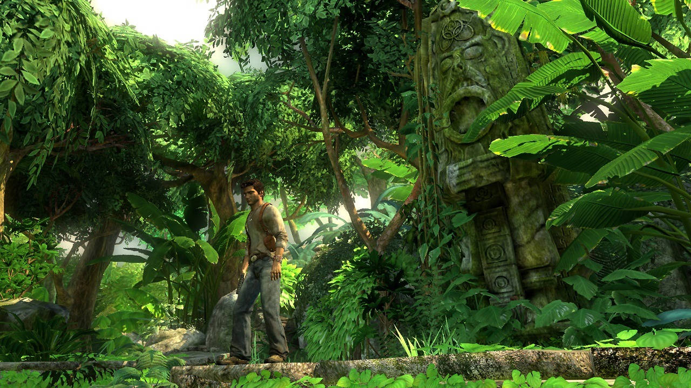

# UNCHARTED

James is a 21-year-old man, with a well-developed knowledge of history and basic fighting skills. He spent his childhood among libraries and combat training. His tutor David, who works at a museum, sat every night with James teaching him history.

### The first challenge:

> The mode of the game begins in the museum, where James enters the museum and begins his adventure in obtaining the map.
> (Decode the lock to open and get it).
> James ran away from the two big men.
> James won this round. His enemies continue to follow him through the game.

### Second challenge:

> They win this round and steal the map. James, with his intellectual ability, was able to memorize things quickly. Now he has a visual image of the map in his brain.

> The first scene of the map was an old castle in the city. He goes there. Hardly all castle doors are locked without key locks. Each door will be unlocked by solving a puzzle.
> James now has to find the second location on the map.

### Third challenge:

James arrives after several challenges to the palace, and sort of challenges and access to the treasure
The final challenge:

> After reaching the treasure, they were having troubles getting the treasure, and the palace itself began to be destroyed after they touched a sacred thing, players should be able to think of the consequences of every puzzle they solve.``
